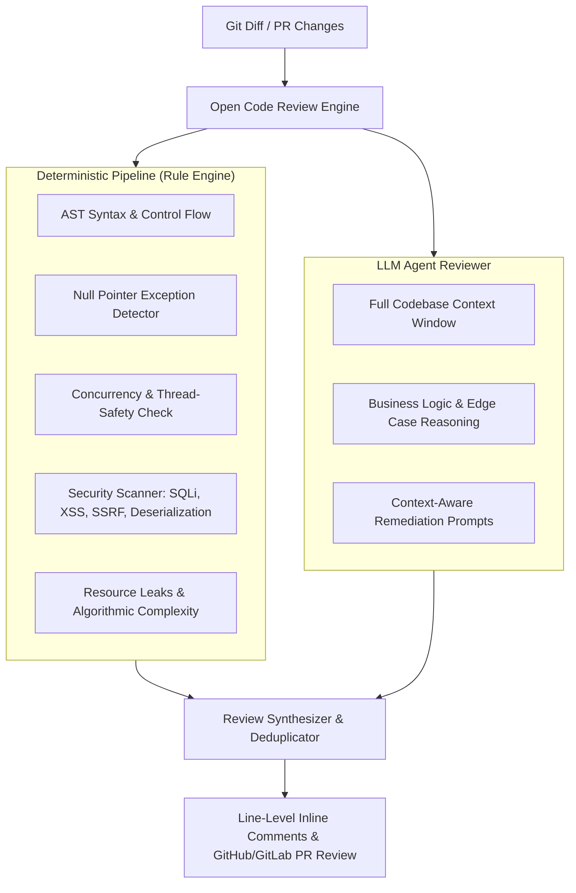

# Alibaba Open Code Review (`ocr`) Reference Guide

> **Official Repository**: [alibaba/open-code-review](https://github.com/alibaba/open-code-review)  
> **Package**: `@alibaba-group/open-code-review`  
> **License**: Apache-2.0  

---

## Overview

Alibaba Open Code Review is a hybrid-architecture code review tool battle-tested at Alibaba scale across millions of lines of code. It combines **deterministic AST analysis pipelines** with **LLM multi-agent reasoning** to provide line-level, high-precision code reviews while eliminating AI hallucination, position drift, and lazy review behavior.



---

## Key Capabilities

1. **Deterministic Static Rule Engine**:
   - **NPE Prevention**: Catches unvalidated dereferences before runtime.
   - **Thread Safety**: Detects shared mutable state, improper locking, race conditions.
   - **Security Rulesets**: Integrated OWASP Top 10 rulesets (SQL Injection, XSS, Path Traversal, Hardcoded Secrets).
   - **Resource Management**: Detects unclosed database connections, file handles, streams.

2. **LLM Agent Intelligence**:
   - Full context window inspection preventing line-drift (comments attached to the exact modified line).
   - Evaluates business logic soundness, architectural alignment, and unintended side effects.
   - OpenAI and Anthropic compatible endpoints.

3. **Multi-Platform Integration**:
   - **Terminal CLI**: Run `ocr review --staged` or `ocr review --branch main`.
   - **CI/CD Integration**: Native GitHub Actions and GitLab CI runners.
   - **AI Coding Harnesses**: Callable within Claude Code, Cursor, Codex, and Antigravity.

---

## Installation & Setup

```bash
# Global npm install
npm install -g @alibaba-group/open-code-review

# Verify installation
ocr --version
```

### Configuration (`.ocrrc.json`)

```json
{
  "provider": "anthropic",
  "apiKey": "process.env.ANTHROPIC_API_KEY",
  "model": "claude-3-7-sonnet",
  "rules": {
    "npe": true,
    "threadSafety": true,
    "security": {
      "sqlInjection": true,
      "xss": true,
      "secretLeaks": true
    },
    "maxCommentsPerFile": 5
  },
  "output": {
    "format": "markdown",
    "inline": true
  }
}
```

---

## Command Reference

| Command | Purpose |
|---|---|
| `ocr review` | Reviews all uncommitted working tree changes |
| `ocr review --staged` | Reviews only staged git changes before commit |
| `ocr review --branch <name>` | Reviews diff between current HEAD and target branch |
| `ocr review --file <path>` | Reviews specific file for static issues and logic |
| `ocr ci` | Runs in CI pipeline and outputs GitHub Actions PR annotations |
