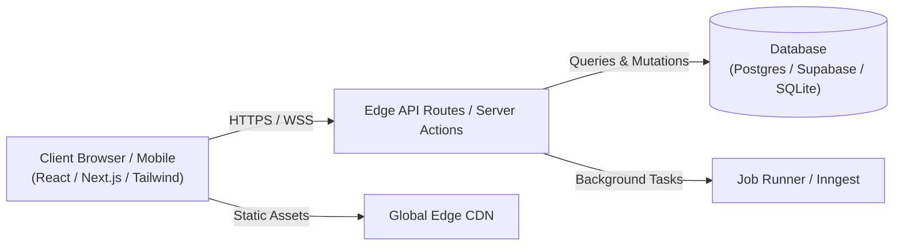

# System Architecture & Technical Specifications

> **Project**: [Project Name]  
> **Last Updated**: [YYYY-MM-DD]  
> **Knowledge Graph Index**: Available via `graphify` (`graphify-windows`)  

---

## 1. High-Level System Architecture



---

## 2. Technology Stack

| Layer | Technology | Purpose & Rationale |
|---|---|---|
| **Frontend Framework** | Next.js 15+ (App Router) | Server Components, streaming SSR, optimal SEO & performance |
| **Language** | TypeScript (Strict Mode) | Strong typing, zero runtime type errors, branded IDs |
| **Styling** | Tailwind CSS v4 + Design Tokens | Utility-first, zero runtime CSS overhead, dark mode tokens |
| **UI Components** | Radix Primitives / Shadcn UI | Accessible, headless, keyboard-navigable foundation |
| **State Management** | React Server Actions + Zustand / SWR | Optimistic updates, minimal client bundle footprint |
| **Backend / DB** | Supabase (PostgreSQL) / Prisma / Kysely | Relational integrity, row-level security (RLS), ACID compliance |
| **Testing** | Playwright + Vitest | Autonomous multi-viewport E2E testing and co-located unit tests |
| **Codebase Graph** | Graphify (`graphify`) | Compressed AST dependency graph (up to 71x token reduction) |

---

## 3. Directory & Folder Structure

```text
├── docs/                      # The 6 Vibe Coding Control Files
│   ├── PRD.md
│   ├── ARCHITECTURE.md
│   ├── RULES.md
│   ├── DESIGN.md
│   ├── TASKS.md
│   └── MEMORY.md
├── src/
│   ├── app/                   # Next.js App Router (pages, layouts, routes)
│   │   ├── (auth)/            # Auth group (login, register)
│   │   ├── (dashboard)/       # Authenticated dashboard views
│   │   └── api/               # Serverless API routes
│   ├── components/            # Reusable UI component primitives
│   ├── features/              # Domain-specific feature modules
│   ├── lib/                   # Database clients, auth helpers, third-party wrappers
│   ├── types/                 # Shared TypeScript types, schemas, branded types
│   └── utils/                 # Pure helper functions
├── tests/                     # Integration and Playwright E2E suites
└── public/                    # Static assets, fonts, icons
```

---

## 4. Graphify Codebase Graph Integration

To inspect the architectural dependencies without overflowing LLM context tokens:
```bash
# Generate/update the codebase AST graph
graphify .

# Query the graph
graphify query "Explain auth flow dependencies"
```
